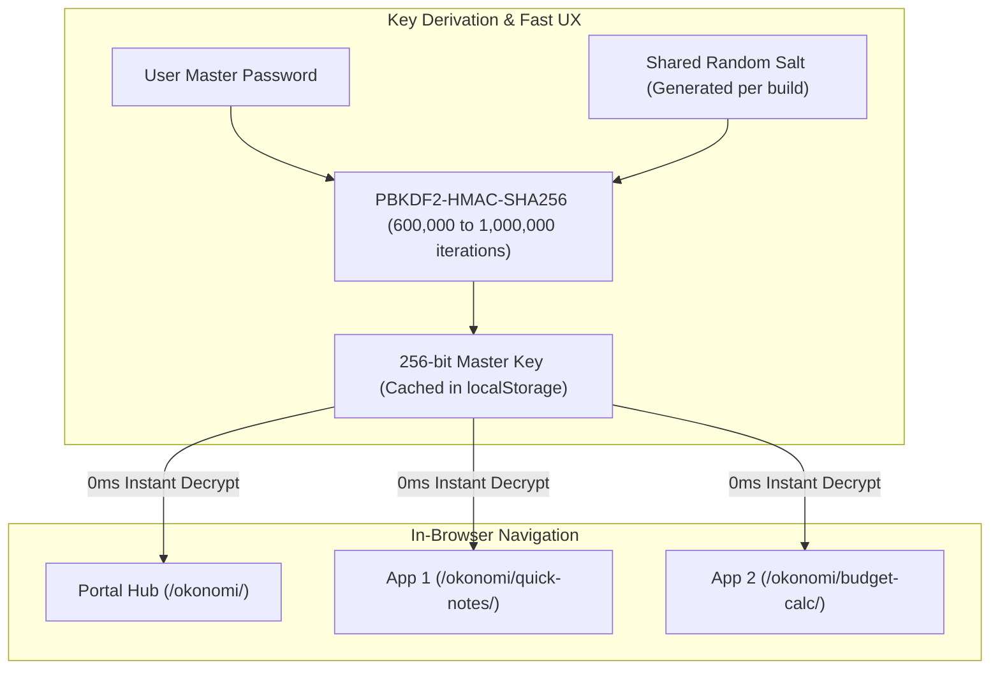

# Implementation Plan: okonomi (お好み)

`okonomi` (お好み — *"as you like it" / "custom choice"*) is a centralized, GitHub-synced repository hosting one-off HTML apps, mini-tools, and private dashboards—fully encrypted at rest, served via GitHub Pages (`viswajithiii.github.io/okonomi/`), and unified under a single-unlock password system.

---

## 1. Security Architecture: Zero-Leak by Design

```text
Local Machine (Plaintext)                    GitHub & Public Internet (Ciphertext Only)
┌───────────────────────────────┐           ┌─────────────────────────────────────────┐
│ PASSWORD (gitignored)         │           │ build.py, deploy.sh, dev.sh (tracked)   │
│ src/apps/ (gitignored)        │  ───────► │ templates/ (tracked generic templates)  │
│ - my-app/index.html           │  build.py │ dist/ (tracked AES-256-GCM ciphertext)  │
│ - quick-notes.html            │           │ - index.html (encrypted portal hub)     │
│ - budget-calc/index.html      │           │ - my-app/index.html (encrypted app)     │
└───────────────────────────────┘           └─────────────────────────────────────────┘
```

> [!IMPORTANT]
> **Strict Separation of Plaintext and Ciphertext in Git**:
> - **Gitignored (Never Pushed)**:
>   - `PASSWORD` — Local master secret file.
>   - `src/apps/` — All raw, unencrypted source code, HTML, CSS, JS, markdown, and assets.
> - **Tracked in Git**:
>   - `build.py`, `deploy.sh`, `dev.sh`, `pyproject.toml`
>   - `templates/` — Generic decryptor shell and portal hub template (zero private data).
>   - `dist/` — **Strictly encrypted AES-256-GCM ciphertext payloads and `.nojekyll`**.
> 
> Safe deployment is enforced in `deploy.sh` via an explicit file allowlist and a pre-commit assertion checking for unstaged plaintext or secret leaks.

---

## 2. Cryptographic Design & Single-Unlock UX



### Shared Master Salt (Zero-Latency Navigation)
- **KDF**: PBKDF2-HMAC-SHA256 with **600,000 iterations** via `window.crypto.subtle`.
- **Shared Build Salt**: All apps generated in the same build share the same 16-byte random salt (`os.urandom(16)`).
- **Single Unlock UX**:
  1. On first visit to any page, user enters master password.
  2. Browser derives the 256-bit AES-GCM key and stores it as base64 in `localStorage` under `okonomi_key`.
  3. All subsequent sub-page visits read the cached key and decrypt in **0ms** without re-prompting.
- **Cache Invalidation & Rotation Handling**:
  - If a new build changes the salt or an invalid key is stored, decryption throws an `OperationError`.
  - The decryptor shell catches the error, automatically clears `localStorage.removeItem('okonomi_key')`, and seamlessly re-prompts for the password.

### Script Execution Strategy
- After successful AES-GCM decryption, the shell invokes:
  ```javascript
  document.open();
  document.write(decryptedHtml);
  document.close();
  ```
- This replaces the decryptor shell and natively runs all inline and external `<script>` tags, stylesheets, and DOM event listeners without sandboxing restrictions or URL mutation.

### Brute-Force & Offline Attack Resistance
- **KDF Throttling**: 600K PBKDF2 iterations drop GPU cracking speeds to < 1,000 guesses/sec per GPU.
- **Zero Metadata Leak**: App names and links are only present inside the encrypted portal payload in `dist/index.html`.

---

## 3. Proposed Repository Structure

```text
/Users/viswa/development/okonomi/
├── PASSWORD                   # [GITIGNORED] Master password
├── .gitignore                 # Enforces ignoring PASSWORD and src/apps/
├── pyproject.toml             # uv dependencies (cryptography, beautifulsoup4)
├── build.py                   # Automated build & encryption engine
├── deploy.sh                  # Safe commit & push with explicit allowlist
├── dev.sh                     # Local preview server
├── README.md                  # Documentation and quickstart guide
│
├── templates/                 # [TRACKED] Generic templates (contain no secrets)
│   ├── decryptor_shell.html   # Self-decrypting bootstrap wrapper
│   └── portal_template.html   # Clean minimalist hub list template
│
├── src/
│   └── apps/                  # [GITIGNORED] Raw unencrypted source apps live here
│       ├── example-calc/      # Multi-file app example
│       │   ├── index.html
│       │   ├── style.css
│       │   └── app.js
│       ├── quick-notes.html   # Standalone single-file HTML example
│       └── travel-pack/       # Checklist app example
│           └── index.html
│
└── dist/                      # [TRACKED] Encrypted outputs published to GitHub Pages
    ├── .nojekyll              # Prevents Jekyll processing on GitHub Pages
    ├── index.html             # Encrypted Hub Portal
    ├── example-calc/
    │   └── index.html         # Self-decrypting encrypted app
    ├── quick-notes/
    │   └── index.html
    └── travel-pack/
        └── index.html
```

---

## 4. Component Details

### [Component 1] Environment & Configuration
- **`.gitignore`**:
  ```gitignore
  # Plaintext sources & secrets (NEVER PUSH TO GIT)
  PASSWORD
  src/apps/
  *.local.*

  # Python & System
  .venv/
  __pycache__/
  *.pyc
  .DS_Store
  ```
- **`pyproject.toml`**: `uv` script definition with `dependencies = ["cryptography>=42.0.0", "beautifulsoup4>=4.12.0"]`.

### [Component 2] Build Engine (`build.py`)
- **Discovery**: Scans `src/apps/` for directories containing `index.html` or standalone `.html` files.
- **Inlining & Bundling**:
  - Parses each app using `BeautifulSoup`.
  - Inlines local `<link rel="stylesheet">` files into `<style>` tags.
  - Inlines local `<script src="...">` files into `<script>` tags.
  - Inlines local `` assets into Base64 Data URIs.
  - Leaves external URLs (`http://`, `https://`, `//`) untouched.
- **Auto-Generated Hub Portal**:
  - Automatically compiles a clean, minimalist launcher page linking to each discovered app slug (e.g. `./quick-notes/`, `./example-calc/`).
  - No manual manifest or YAML configuration required.
- **Encryption**:
  - Generates a shared 16-byte random salt per build.
  - Derives AES-256-GCM key from `PASSWORD` via PBKDF2 (600,000 iterations).
  - Encrypts each bundled app HTML with AES-256-GCM (`os.urandom(12)` IV).
  - Embeds payload into `templates/decryptor_shell.html` as:
    ```html
    <script id="okonomi-data" type="application/json">
    {
      "salt": "base64...",
      "iv": "base64...",
      "ciphertext": "base64..."
    }
    </script>
    ```
- Writes outputs to `dist/` and ensures `dist/.nojekyll` exists.
- CLI helper: `uv run build.py --generate-passphrase` for creating high-entropy Diceware master passwords.

### [Component 3] Decryptor Shell (`templates/decryptor_shell.html`)
- Clean zero-dependency vanilla JS bootstrap with a minimalist dark-mode aesthetic.
- Reads `#okonomi-data` JSON.
- If `localStorage.getItem('okonomi_key')` exists:
  - Tries instant AES-GCM decryption.
  - On success: runs `document.open(); document.write(html); document.close();`.
  - On failure (`OperationError`): clears cached key and shows password modal.
- If no cached key:
  - Displays password input form.
  - On submit: derives key via `crypto.subtle.deriveKey`, saves to `localStorage`, decrypts and replaces DOM.
- Includes a floating "Lock" / "Clear Cache" button (or keyboard shortcut) to clear `localStorage`.

### [Component 4] Workflow Scripts
- **`deploy.sh`**:
  1. Runs `uv run build.py || exit 1`.
  2. Runs a safety check ensuring `PASSWORD` and `src/apps/` are not staged.
  3. Explicitly stages only safe paths:
     ```bash
     git add dist/ templates/ build.py deploy.sh dev.sh pyproject.toml README.md IMPLEMENTATION_PLAN.md
     ```
  4. Commits with `$1` and pushes to GitHub.
- **`dev.sh`**: Runs build and launches local static HTTP server at `http://localhost:8000/dist/`.

---

## 5. Verification Plan

### Automated Build Verification
1. Run `uv run build.py` from `/Users/viswa/development/okonomi`.
2. Check `git status` to verify `PASSWORD` and `src/apps/` remain ignored and untracked.
3. Inspect `dist/index.html` and `dist/<app-slug>/index.html` to confirm only base64 ciphertext and the decryptor shell exist with zero plaintext source tokens.

### Manual Verification
1. Launch `dev.sh` and open `http://localhost:8000/dist/` in browser.
2. Enter master password, verify portal decrypts and displays the app list.
3. Click an app; verify sub-page opens and decrypts with 0ms delay via shared `localStorage`.
4. Verify all JavaScript, styles, and interactivity inside the decrypted app function normally.
5. Trigger "Lock" or clear `localStorage` to verify the page re-locks and prompts for the password.
6. Rebuild with a fresh salt, reload page, and verify the app gracefully detects stale key, auto-clears `localStorage`, and prompts for password again.
